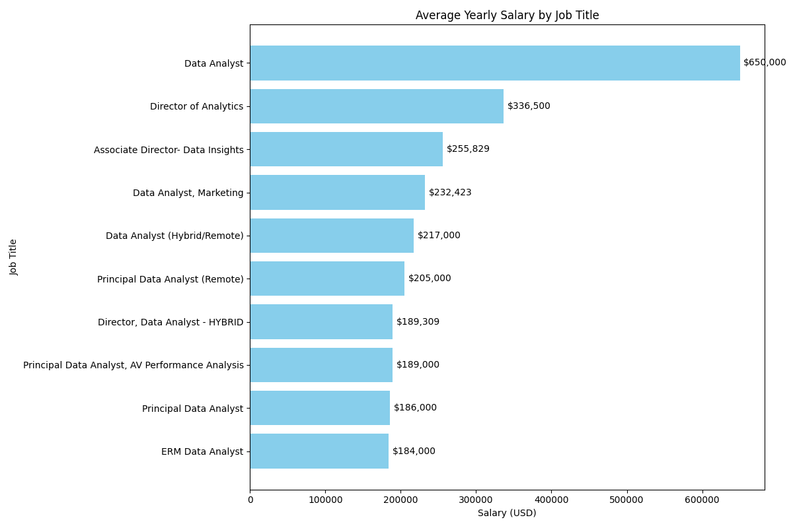
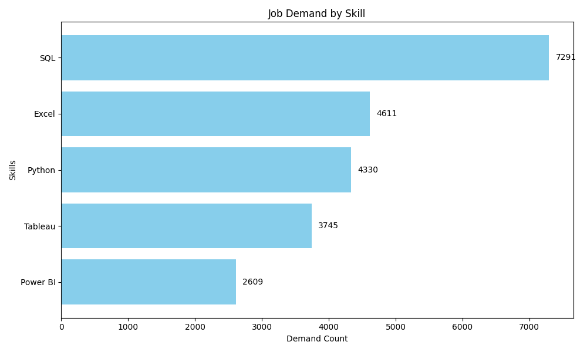

# Introduction
Dive into the data job market! Focusing on data analyst roles, this project explores top-paying jobs, in-demand skills, and where high demand meets high salary in data analytics. 

SQL queries? Check them out here: [project_sql folder](/project_sql/)
# Background 
This was done as project/bootcamp to learn and master SQL. 

Data hails from [this SQL course](https://lukebarousse.com/sql).

### The questions I wanted to answer through these queries were:

1. What are the top-paying data analyst jobs? 
2. What skills are required for these top-paying jobs? 
3. What skills are most in demand for data analysts? 
4. Which skills are associated with higher salaries? 
5. What are the most optimal skills to learn?

# Tools I Used
For my deep dive into the data analyst job market, I harnessed the power of several key tools: 

- **SQL**: Allowed me to query the database.
- **PostgreSQL**: The chosen database management system.
- **Visual Studio Code**: My go-to for database management and executing SQL queries. 
- **Git and GitHub**: For version control and sharing my SQL scripts and analysis for easy collaboration and project tracking. 

# The Analysis 
Each query aimed at finding aspects of the data analyst job market. Here's how I approached each question: 

### 1. Top Paying Data Analyst Jobs
```sql
SELECT 
    name AS company_name,
    skill_id,
    job_title,
    job_location,
    job_schedule_type,
    salary_year_avg,
    job_posted_date
FROM
    job_postings_fact
LEFT JOIN company_dim ON job_postings_fact.company_id = company_dim.company_id
LEFT JOIN skills_job_dim ON job_postings_fact.job_id = skills_job_dim.job_id
WHERE 
    job_title_short = 'Data Analyst' AND
    job_location = 'Anywhere' AND
    salary_year_avg IS NOT NULL
ORDER BY 
    salary_year_avg DESC
LIMIT 10
```

*Skills for top-paying jobs chart generated from Python in VS Code*
### 2. Skills for Top Paying Jobs
```sql
WITH top_paying_jobs AS (
    SELECT
        job_id,
        job_title,
        salary_year_avg, 
        name AS company_name
    FROM
        job_postings_fact
    LEFT JOIN company_dim ON job_postings_fact.company_id = company_dim.company_id
    WHERE 
        job_title_short = 'Data Analyst' AND
        job_location = 'Anywhere' AND
        salary_year_avg IS NOT NULL
    ORDER BY 
        salary_year_avg DESC
    LIMIT 10
)

SELECT 
    top_paying_jobs.*,
    skills
FROM top_paying_jobs
INNER JOIN skills_job_dim ON top_paying_jobs.job_id = skills_job_dim.job_id
INNER JOIN skills_dim ON skills_job_dim.skill_id = skills_dim.skill_id
ORDER BY
    salary_year_avg DESC
```

*Skills for top-paying jobs chart generated from Python in VS Code*
### 3. In-Demand Skills for Data Analysts
```sql
SELECT 
    skills,
    COUNT(skills_job_dim.job_id) AS demand_count
FROM job_postings_fact
INNER JOIN skills_job_dim ON job_postings_fact.job_id = skills_job_dim.job_id
INNER JOIN skills_dim ON skills_job_dim.skill_id = skills_dim.skill_id
WHERE
    job_title_short = 'Data Analyst' AND 
    job_work_from_home = 'True'
GROUP BY
    skills
ORDER BY
    demand_count DESC
LIMIT 5
```
| Rank | Skill     | Demand |
|------|-----------|--------------|
| 1    | SQL       | 7,291        |
| 2    | Excel     | 4,611        |
| 3    | Python    | 4,330        |
| 4    | Tableau   | 3,745        |
| 5    | Power BI  | 2,609        |
*Table of the demand for the top 5 skills in data analyst job postings*
### 4. Skills Based on Salary
```sql
SELECT 
    skills_dim.skill_id,
    skills,
    ROUND (AVG(salary_year_avg), 0) AS avg_salary
FROM job_postings_fact
INNER JOIN skills_job_dim ON job_postings_fact.job_id = skills_job_dim.job_id
INNER JOIN skills_dim ON skills_job_dim.skill_id = skills_dim.skill_id
WHERE
    job_title_short = 'Data Analyst'
    AND salary_year_avg IS NOT NULL
    AND job_work_from_home = True 
GROUP BY
    skills_dim.skill_id
ORDER BY 
    avg_salary DESC
LIMIT 10
```
| Skill          | Average Salary  |
|---------------|------------------|
| PySpark       | 208,172          |
| Bitbucket     | 189,155          |
| Couchbase     | 160,515          |
| Watson        | 160,515          |
| DataRobot     | 155,486          |
| GitLab        | 154,500          |
| Swift         | 153,750          |
| Jupyter       | 152,777          |
| Pandas        | 151,821          |
| Elasticsearch | 145,000          |
*Table of the average salary for the top 10 paying skills for data analysts*
### 5. Most Optimal Skills to Learn
```sql
WITH skills_demand AS (
    SELECT 
        skills_dim.skill_id,
        skills,
        COUNT(skills_job_dim.job_id) AS demand_count
    FROM job_postings_fact
    INNER JOIN skills_job_dim ON job_postings_fact.job_id = skills_job_dim.job_id
    INNER JOIN skills_dim ON skills_job_dim.skill_id = skills_dim.skill_id
    WHERE
        job_title_short = 'Data Analyst'
        AND salary_year_avg IS NOT NULL
        AND job_work_from_home = 'True' 
    GROUP BY
        skills_dim.skill_id
), average_salary AS (
    SELECT 
        skills_dim.skill_id,
        skills,
        ROUND (AVG(salary_year_avg), 0) AS avg_salary
    FROM job_postings_fact
    INNER JOIN skills_job_dim ON job_postings_fact.job_id = skills_job_dim.job_id
    INNER JOIN skills_dim ON skills_job_dim.skill_id = skills_dim.skill_id
    WHERE
        job_title_short = 'Data Analyst'
        AND salary_year_avg IS NOT NULL
        AND job_work_from_home = True 
    GROUP BY
        skills_dim.skill_id
)

SELECT 
    skills_demand.skill_id,
    skills_demand.skills,
    demand_count,
    avg_salary
FROM
    skills_demand
INNER JOIN average_salary ON skills_demand.skill_id = average_salary.skill_id
WHERE
    demand_count > 10
ORDER BY
    avg_salary DESC,
    demand_count DESC    
LIMIT 25
```
| Skill      |  Average Salary  |
|------------|------------------|
| Go         | 115,320          |
| Confluence | 114,210          |
| Hadoop     | 113,193          |
| Snowflake  | 112,948          |
| Azure      | 111,225          |
| BigQuery   | 109,654          |
| AWS        | 108,317          |
| Java       | 106,906          |
| SSIS       | 106,683          |
| Jira       | 104,918          |
*Table of the most optimal skills for data analyst sorted by salary*
# What I Learned

I gained some valuable insight on: 

- Complex Query Crafting: Mastered some advanced SQL, merged tables using CTE's and conquered WITH clauses.
- Data Aggegation: Learned GROUP BY and used aggregate functions like COUNT() and AVG().
- Analytical Wizardry: Leveled up real-world puzzle-solving skills, turning questions into actionable SQL queries.

# Conclusions

### Insights 

From the analysis, I had several insights: 

1. Top-Paying Data Analyst Jobs: The highest paying jobs for data analysts ranged all the way up to $650,000! 
2. Skills for Top-Paying Jobs: SQL seems to be a mainstay of a data analysts' toolbelt. 
3. In-Demand Skills: SQL and Excel seem to be the most in-demand, regardless of salary. 
4. Skills Based on Salary: Unique and job-specific level skills such as pyspark and bitbucket seem to fetch the highest salary. 
5. Optimal Skills to Learn: SQL is at the sweet spot where demand and high salary remain high. 

Although having the niche skills can pay off, SQL still has a higher ROI because of it's relatively high demand. 

### Closing Thoughts 

Completing this project enhanced my knowledge of SQL to a level where I feel comfortable writing my own queries and digging into my own insights and questions. It also showed me the importance of primary keys and foreign keys, how they relate to each other within a database, and how SQL can be used to gain valuable insights to the questions we all want answered. 


